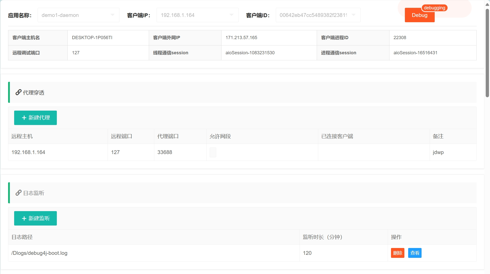
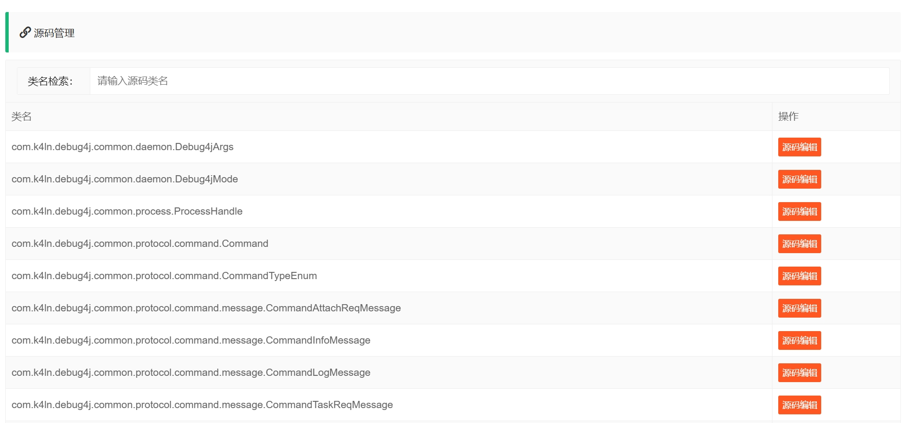
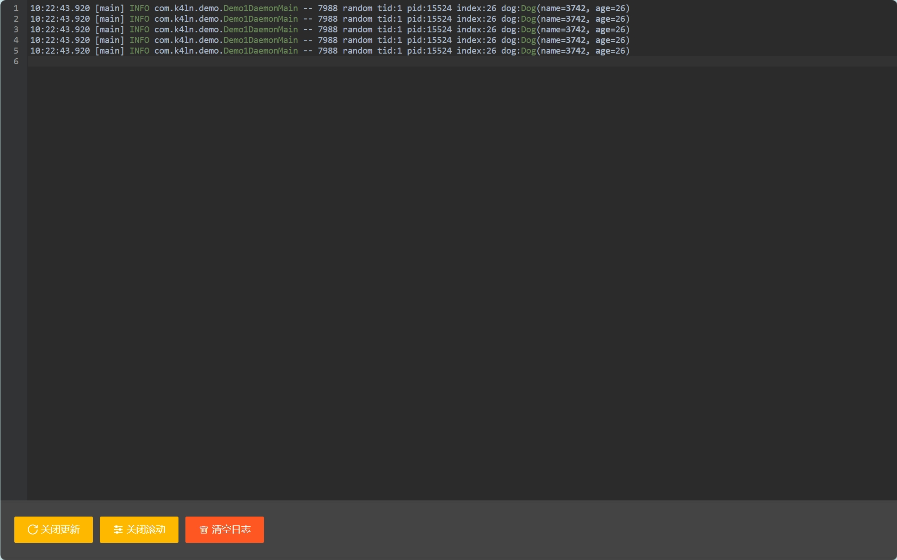
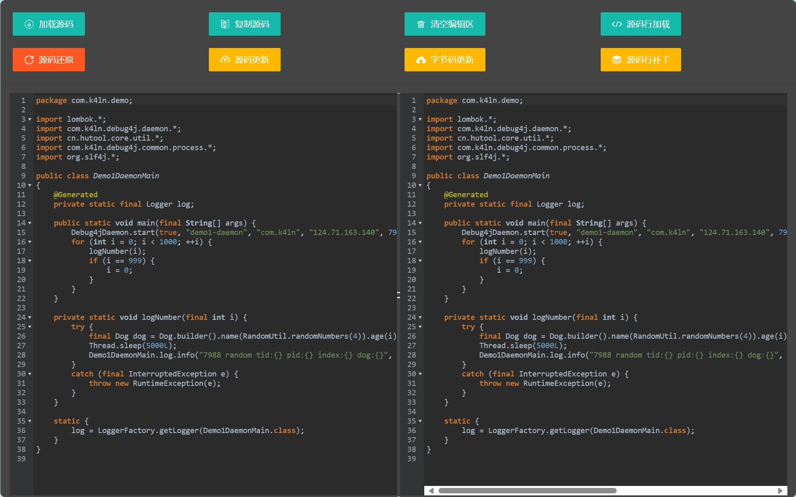
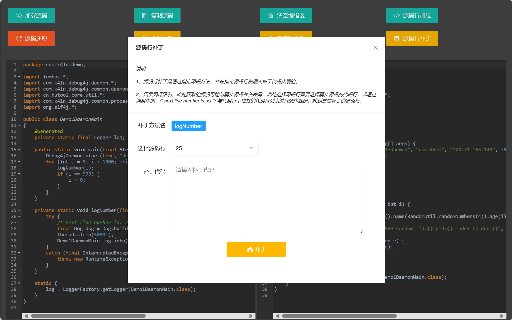

# Debug4j

**Debug4j** is a highly efficient and user-friendly Java debugging tool designed for debugging Java code on remote servers. It offers a creative approach to visualizing and modifying remote code in real-time. With easy deployment and rapid integration, Debug4j is a must-have for any Java developer.

---

## Supported Versions

- This repository supports JDK 8 and higher.
- For the best experience with JDK 17+, please visit [debug4j](https://github.com/ifeng113/debug4j).

---

## Features

- **Proxy Penetration Service**: Enables remote proxy penetration in isolated environments like Docker and Kubernetes.
- **JWDP Remote Debugging**: Simplifies remote debugging configuration.
- **Log File Monitoring**: Real-time access to application logs.
- **Read Program Classes and Source Code**: Dynamically load and analyze target program classes and source code.
- **Source Code Hot Updates**: Supports runtime updates to source code.
- **Bytecode Hot Updates**: Directly modify and update bytecode.
- **Line-Level Source Code Insertion**: Quickly insert debugging code.
- **Code Reversion**: Revert to the state before the update.

---

## Getting Started

### Install the Server

1. Pull the Docker image:
   ```bash
   docker pull k4ln/debug4j-server:0.0.1_jdk8
   ```

2. Start the server:
   ```bash
   docker run --net=host -d --name debug4j-server k4ln/debug4j-server:0.0.1_jdk8
   ```

3. Set the communication and API keys:
   ```bash
   docker run --net=host -d --name debug4j-server k4ln/debug4j-server:0.0.1_jdk8 \
       --debug4j.key=k4ln --sa-token.http-basic='k4ln:123456'
   ```
   - `--debug4j.key`: Sets the communication key.
   - `--sa-token.http-basic`: Sets the API key for communication.

> **Port Information**

- `7987`: API and web debugging port. Access [http://debug4j-server:7987](http://debug4j-server:7987) for the debugging management page.
- `7988`: Communication port between debug4j-server and the application. Configured via `--debug4j.socket-port`.
- `33000-34000`: Default proxy open port range for debug4j-server. If deploying the server on the public internet, ensure these ports are secured via firewall settings. Configured via `--debug4j.min-proxy-port` and `--debug4j.max-proxy-port`.

> API documentation is available in [Debug4j.postman_collection.json](https://github.com/ifeng113/debug4j-jdk8/blob/master/src/main/resources/Debug4j.postman_collection.json).

### Debugging Interface Highlights

- **Debugging Configuration + Proxy Management + Log Management**:
  

- **Source Code and Class Management**:
  

- **Log Viewing**:
  

- **Source Code Hot Updates**:
  

- **Source Code Patching**:
  

---

### Java Application Integration

Add the following dependency to your project:
```xml
<dependency>
    <groupId>io.github.ifeng113</groupId>
    <artifactId>jdk8-debug4j-daemon</artifactId>
    <version>0.0.1</version>
</dependency>
```

Start Debug4j in your application:
```java
Debug4jDaemon.start(true, "demo1-daemon", "com.k4ln", "192.168.1.13", 7988, "k4ln");
```
Sample code is available in [debug4j-demo1](https://github.com/ifeng113/debug4j-jdk8/tree/master/debug4j-demo1).

---

### Spring Boot Project Integration

Add the following dependency to your project:
```xml
<dependency>
    <groupId>io.github.ifeng113</groupId>
    <artifactId>jdk8-debug4j-spring-boot-starter</artifactId>
    <version>0.0.1</version>
</dependency>
```

Configure Debug4j in `application.yml`:
```yaml
debug4j:
  package-name: com.k4ln
  host: 192.168.1.13
  port: 7988
  key: k4ln
```
Sample code is available in [debug4j-demo2](https://github.com/ifeng113/debug4j-jdk8/tree/master/debug4j-demo2).

---

## Limitations and Notes

1. **Class Signature Limitations**:
   - Code or bytecode hot updates cannot modify class field names or method names (class signature).
   - JVM supports adding new methods and variables but does not support removal. Debug4j currently supports only internal changes to method bodies.

2. **Agent Compatibility Issues**:
   - Using agents (e.g., ByteBuddy) may modify bytecode, making source code and bytecode hot updates unavailable.
   - In JDK 8, line-level code insertion might not work due to the inability to decompile and execute source code.
   - It is recommended to avoid using agents or adjust configurations accordingly.

3. **Bytecode Version Compatibility**:
   - Ensure that class files used for hot updates are compiled with a version compatible with the target JVM.

4. **Code Patch Usage Notes**:
   - When using third-party utility classes, always use the fully qualified name to avoid compilation failures due to class name conflicts.

   Example:
   ```json
   {
       "clientSessionId": "aioSession-1341587928",
       "className": "com.k4ln.demo.Demo1DaemonMain",
       "lineMethodName": "logNumber",
       "lineNumber": 24,
       "sourceCode": "log.info(\"com.alibaba.fastjson2.JSON.toJSONString(patch13)\");"
   }
   ```

---

## Acknowledgments

- [Smart-Socket](https://github.com/smartboot/smart-socket)
- [Sa-Token](https://github.com/dromara/sa-token)

