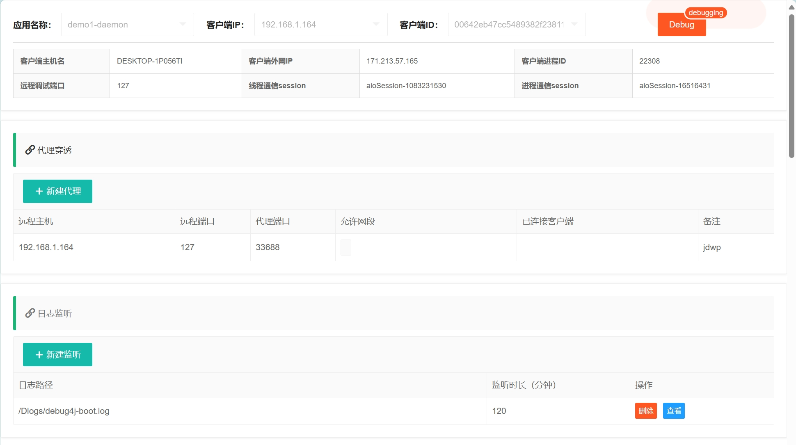
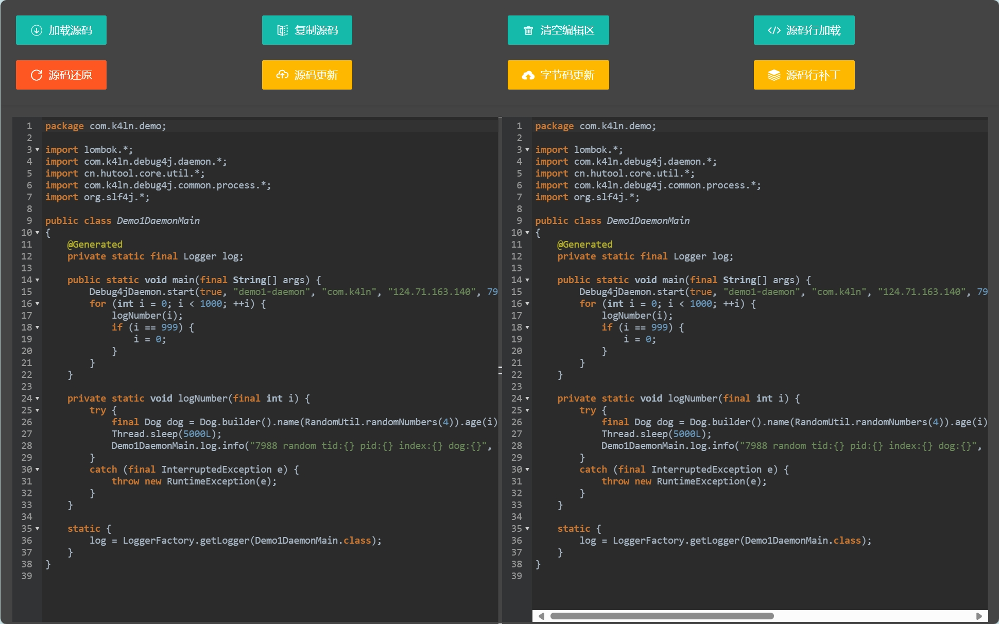

# Debug4j

**Debug4j** 是一款高效便捷的 Java 调试工具，专注于远程服务器端的 Java 代码调试。它通过极具创意的方式实现了可视化远程代码修改与调试功能，具备轻松部署与快速集成的特点。

### 支持版本
- 本仓库适用于 JDK 8 及以上版本。
- 如果您使用的是 JDK 17 +，为了更好的使用体验请移步至 [debug4j](https://github.com/ifeng113/debug4j)。

---

## 功能特点

- **代理穿透服务**：内网隔离（如docker、k8s）环境下的远程代理穿透。
- **JWDP 远程调试**：便捷的远程调试配置。
- **日志文件监听**：实时获取应用日志信息。
- **读取程序类及源码**：动态加载和解析目标程序的类及源码。
- **源码热更新**：支持运行时源码的动态更新。
- **字节码热更新**：直接修改和更新字节码。
- **行级源码插入**：快速插入调试代码。
- **代码还原**：恢复至更新前的状态。

---

## 快速入门

### 安装服务端

1. 拉取 Docker 镜像：
   ```bash
   docker pull k4ln/debug4j-server:0.0.1.1_jdk8
   ```

2. 启动服务端：
   ```bash
   docker run --net=host -d --name debug4j-server k4ln/debug4j-server:0.0.1.1_jdk8
   ```

3. 设置通信密钥和 API 密钥：
   ```bash
   docker run --net=host -d --name debug4j-server k4ln/debug4j-server:0.0.1.1_jdk8 \
       --debug4j.key=k4ln --sa-token.http-basic='k4ln:123456'
   ```

   - `--debug4j.key`：设置通信密钥。
   - `--sa-token.http-basic`：设置 API 通信密钥。

>**端口说明**

- `7987`：api及web调试端口，访问[http://debug4j-server:7987](http://debug4j-server:7987) 进入调试管理页面。
- `7988`：debug4j-server与被调试应用的通信端口。配置项： `--debug4j.socket-port`。
- `33000-34000`：debug4j-server默认代理开放端口区段，如果server部署在公网中，请关闭对应端口防火墙。配置项： `--debug4j.min-proxy-port` 与 `--debug4j.max-proxy-port`。

> API 文档见 [Debug4j.postman_collection.json](https://github.com/ifeng113/debug4j-jdk8/blob/master/src/main/resources/Debug4j.postman_collection.json) 。

> **调试配置 + 代理管理 + 日志管理**



> **源码类管理**


> **日志查看**


> **源码热更新**



> **源码补丁**


---

### Java 应用集成

在您的项目中添加以下依赖：
```xml
<dependency>
    <groupId>io.github.ifeng113</groupId>
    <artifactId>jdk8-debug4j-daemon</artifactId>
    <version>0.0.1</version>
</dependency>
```

在应用程序中启动 Debug4j：
```java
Debug4jDaemon.start(true, "demo1-daemon", "com.k4ln", "192.168.1.13", 7988, "k4ln");
```
示例代码请参考 [debug4j-demo1](https://github.com/ifeng113/debug4j-jdk8/tree/master/debug4j-demo1)。

---

### Spring Boot 项目集成

在您的项目中添加以下依赖：
```xml
<dependency>
    <groupId>io.github.ifeng113</groupId>
    <artifactId>jdk8-debug4j-spring-boot-starter</artifactId>
    <version>0.0.1</version>
</dependency>
```

在 `application.yml` 中配置 Debug4j：
```yaml
debug4j:
  package-name: com.k4ln
  host: 192.168.1.13
  port: 7988
  key: k4ln
```
示例代码请参考 [debug4j-demo2](https://github.com/ifeng113/debug4j-jdk8/tree/master/debug4j-demo2)。

---

## 使用限制与注意事项

1. **类签名限制**：
   - 代码热更新或字节码热更新无法修改类的字段名或方法名（即类签名）。
   - JVM 支持新增方法和变量，但不支持删除，Debug4j 暂仅支持方法体内部代码变更。

2. **Agent 兼容性问题**：
   - 使用 Agent（如 ByteBuddy）可能修改字节码，导致源码热更新和字节码热更新功能不可用。
   - 在 JDK 8 环境下，因无法反编译执行源码，行级源码插入功能也可能不可用。
   - 推荐尽量避免使用 Agent 或调整相关配置。

3. **字节码版本兼容性**：
   - 确保用于热更新的类文件编译版本与目标 JVM 兼容。

4. **代码行补丁注意事项**：
   - 使用第三方工具类时，请使用全路径，避免重名类导致编译失败。
   
   示例：
   ```json
   {
       "clientSessionId": "aioSession-1341587928",
       "className": "com.k4ln.demo.Demo1DaemonMain",
       "lineMethodName": "logNumber",
       "lineNumber": 24,
       "sourceCode": "log.info(\"com.alibaba.fastjson2.JSON.toJSONString(patch13)\");"
   }
   ```

---

## 致谢

- [Smart-Socket](https://github.com/smartboot/smart-socket)
- [Sa-Token](https://github.com/dromara/sa-token)

