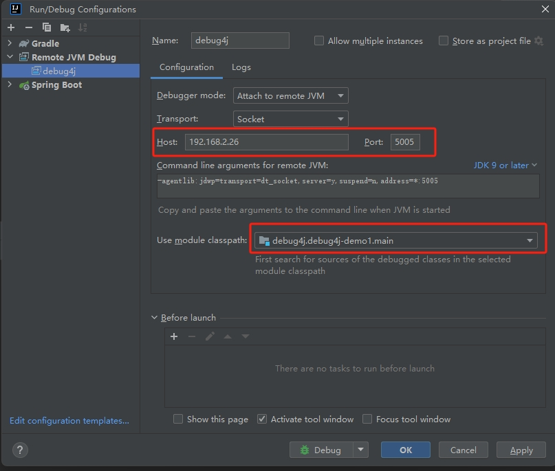
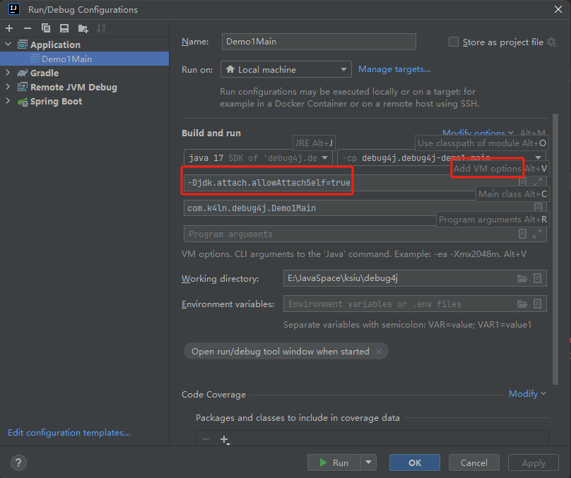

### step1

`
java -agentlib:jdwp=transport=dt_socket,server=y,suspend=n,address=*:5005 -jar .\debug4j-demo1-1.0-SNAPSHOT-all.jar
`

> **_IDEA 开启远程调试_**


### step2
> 调试：*Agent.premain()*

`
java -javaagent:E:\JavaSpace\ksiu\debug4j\debug4j-agent\build\libs\debug4j-agent-1.0-SNAPSHOT-all.jar -jar .\debug4j-demo1-1.0-SNAPSHOT-all.jar
`

---

> 调试：*Agent.agentmain()* 

方式一：
```text
本地启动Demo1Main，再启动AgentMain，在Demo1Main的控制台就能看到attach日志
```


方式二：
> _需放开Demo1Main中"VirtualMachine.attach"相关代码（此时是attach自身）_



方式三：
> _需放开Demo1Main中"VirtualMachine.attach"相关代码（此时是attach自身）_

IDEA Terminal启动失败（_错误: 找不到或无法加载主类 .attach.allowAttachSelf=true_），__使用【cmd】命令启动：__

`
java -Djdk.attach.allowAttachSelf=true -jar .\debug4j-demo1-1.0-SNAPSHOT-all.jar
`

### step3

__*rollback：*__ 无法通过Attach API动态加载jdwp，调整方案为：手动配置远程调试jvm启动参数，agent仅作agent端